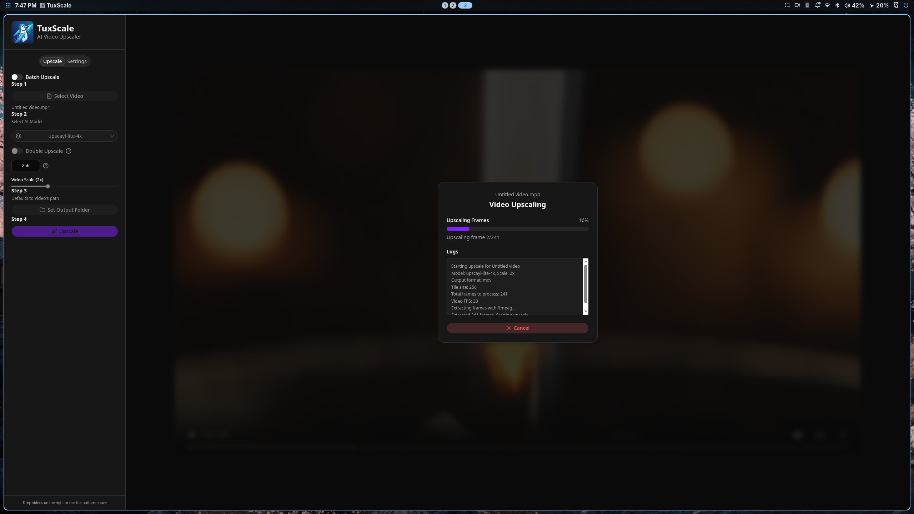

<div align="center">
  
</div>

<div align="center">
  
</div>

<h1 align="center">🐧 TuxScale</h1>

<p align="center">
  <strong>AI-powered video upscaling for Linux</strong>
</p>

<p align="center">
  
  
  
  
  
  
</p>

---

## Table of Contents

- [Features](#features)
- [How it Works](#how-it-works)
- [Prerequisites](#prerequisites)
- [Project Setup](#project-setup)
- [CI Builds](#ci-builds)
- [Tech Stack](#tech-stack)
- [Credits](#credits)

---

## Features

- **AI Frame Upscaling** — Extracts video frames and upscales each one using Real-ESRGAN via the [upscayl-ncnn](https://github.com/upscayl/upscayl-ncnn) Vulkan inference engine.
- **Desktop UI** — Clean Electron + React interface for easy operation.
- **Batch Processing** — Handle entire videos in one go.
- **Linux Native** — Built and packaged for Linux (AppImage, deb, rpm, pacman).
- **Self-Contained** — Backend binary and models are bundled with the app.

---

## How it Works

```
 Input Video (FFmpeg)  ──►  Extract Frames  ──►  Upscale Each Frame (upscayl-ncnn)  ──►  Reassemble Video (FFmpeg)  ──►  Output
```

TuxScale extracts frames from a video using FFmpeg, upscales each frame using the [upscayl-ncnn](https://github.com/upscayl/upscayl-ncnn) Vulkan-based AI inference engine, and reassembles the upscaled frames back into a video — all through an intuitive desktop UI.

The app bundles the upscayl-ncnn backend binary and AI models inside the package via `extraResources` in electron-builder. The backend binary is downloaded fresh from the latest upstream release during CI builds, so it stays up to date without manual tracking.

---

## Prerequisites

- [FFmpeg](https://ffmpeg.org/) (with `ffprobe`) installed on your system
- A Vulkan-compatible GPU

---

## Project Setup

### Install

```bash
bun install
```

### Development

```bash
bun run dev
```

### Build (Linux only)

```bash
bun run build:linux
```

This produces the following artifacts in `dist/`:

- **AppImage** — portable Linux executable
- **.deb** — Debian/Ubuntu package
- **.rpm** — Fedora/RHEL package
- **.pkg.tar.zst** — Arch Linux pacman package

---

## CI Builds

The repository includes a GitHub Actions workflow (`.github/workflows/build.yml`) that can be triggered **manually** from the Actions tab in the GitHub UI:

1. Go to your repository on GitHub
2. Click the **Actions** tab
3. Select **Build Linux** from the left sidebar
4. Click **Run workflow** → **Run workflow**

The workflow will:

1. Download the latest upscayl-bin backend binary from the upscayl-ncnn release
2. Install dependencies with Bun
3. Build the Electron app targeting Linux (AppImage, deb, rpm, pacman)
4. Upload all artifacts to the workflow run
5. Create a GitHub Release with the artifacts attached

All four Linux package formats are automatically available for download from the release.

---

## Tech Stack

| Category | Technology |
|---|---|
| **Desktop Framework** | [Electron](https://www.electronjs.org/) |
| **Frontend** | [React](https://reactjs.org/) + [TypeScript](https://www.typescriptlang.org/) |
| **Build Tooling** | [electron-vite](https://electron-vite.org/) / [Vite](https://vitejs.dev/) |
| **Packaging** | [electron-builder](https://www.electron.build/) |
| **Styling** | [Tailwind CSS](https://tailwindcss.com/) + [shadcn/ui](https://ui.shadcn.com/) |
| **AI Backend** | [upscayl-ncnn](https://github.com/upscayl/upscayl-ncnn) |

---

## Credits

TuxScale is inspired by and builds upon the fantastic work of [Upscayl](https://github.com/upscayl/upscayl) — the #1 free and open-source AI image upscaler. Special thanks to the Upscayl team for their backend ([upscayl-ncnn](https://github.com/upscayl/upscayl-ncnn)) and inspiration.
